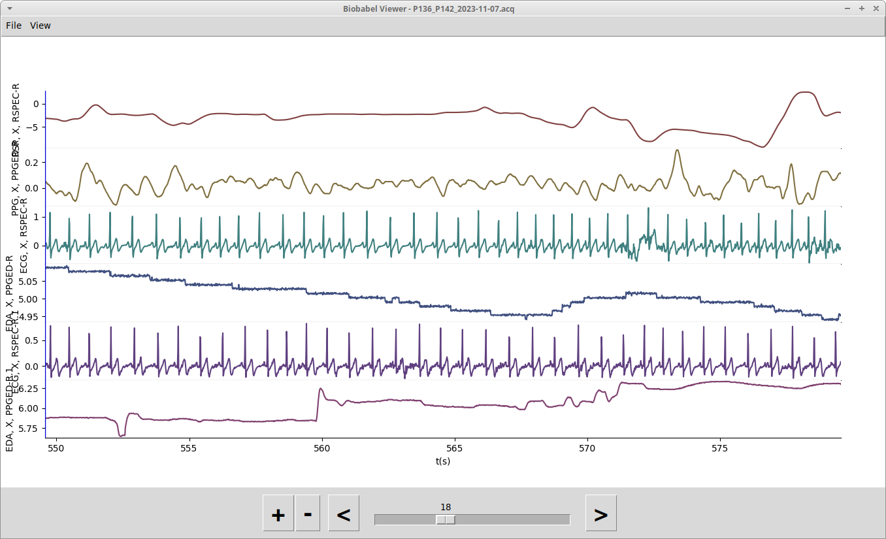
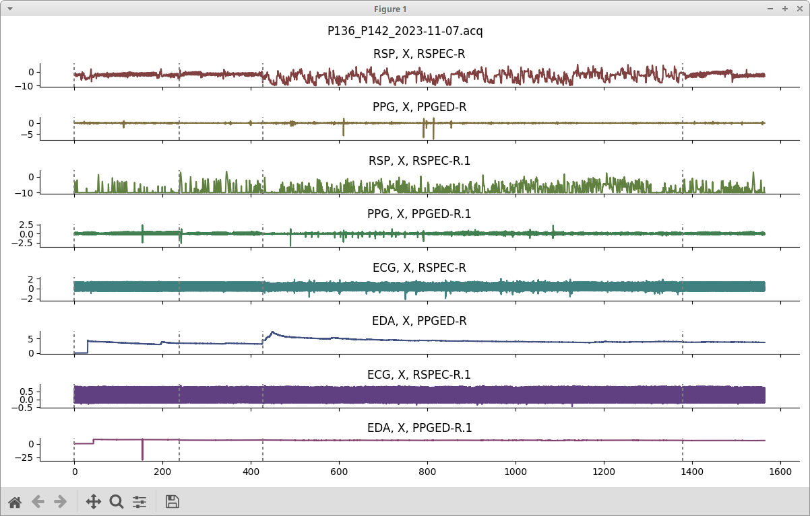
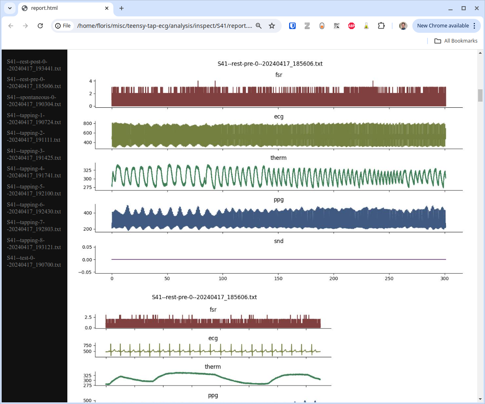

Command-line usage
==================

From the terminal or command prompt, you can use the following commands.
To show basic info about a file, use the following command. Shown below is example output.

.. code-block:: console
		
   $ bioinfo <FILENAME>

   Guessed that this is acq format.
   Summary of P136_P142_2023-11-07.acq
   · date  2023/11/12 18:25:28 

   Participant 'participant'
   ∟ channel RSP, X, RSPEC-R [ modality rsp, in Volts ] 1564949 samples @ 1000.0 Hz = 1564.9 s
   ∟ channel PPG, X, PPGED-R [ modality ppg, in Volts ] 1564949 samples @ 1000.0 Hz = 1564.9 s
   ∟ channel RSP, X, RSPEC-R.1 [ modality rsp, in Volts ] 1564949 samples @ 1000.0 Hz = 1564.9 s
   ∟ channel PPG, X, PPGED-R.1 [ modality ppg, in Volts ] 1564949 samples @ 1000.0 Hz = 1564.9 s
   ∟ channel ECG, X, RSPEC-R [ modality ecg, in mV ] 1564949 samples @ 1000.0 Hz = 1564.9 s
   ∟ channel EDA, X, PPGED-R [ modality eda, in microsiemens ] 1564949 samples @ 1000.0 Hz = 1564.9 s
   ∟ channel ECG, X, RSPEC-R.1 [ modality ecg, in mV ] 1564949 samples @ 1000.0 Hz = 1564.9 s
   ∟ channel EDA, X, PPGED-R.1 [ modality eda, in microsiemens ] 1564949 samples @ 1000.0 Hz = 1564.9 s

   Markers:
   ∟ marker None : 4 events

   
To preview a file, use the provided script from the command line:

.. code-block:: console
		
   $ bioview <FILENAME>

   
Or, for a simpler lightweight viewer:

.. code-block:: console
		
   $ biobabel <FILENAME>

	   
   
You can omit `<FILENAME>` in which case you will be prompted to select a file you want to preview.

To turn one or multiple files into an HTML rendition:

.. code-block:: console
		
   $ biohtml <FILENAME(s)>

This will create a file `report.html` containing an accessible overview of all the files specified, which can be opened in your web browser like so:

To split a file into multiple files along the marker time series (this will create `<FILENAME_001>`, `<FILENAME_002>` etc.:

.. code-block:: console
		
   $ biosplit <FILENAME>

To merge multiple files into a single output file (assuming that all channels have the same time onset):

.. code-block:: console
		
   $ biomerge <FILE1> <FILE2> ... <OUTPUT_FILE>

To convert a file to HDF5:

.. code-block:: console
		
   $ tohdf5 <FILENAME>

