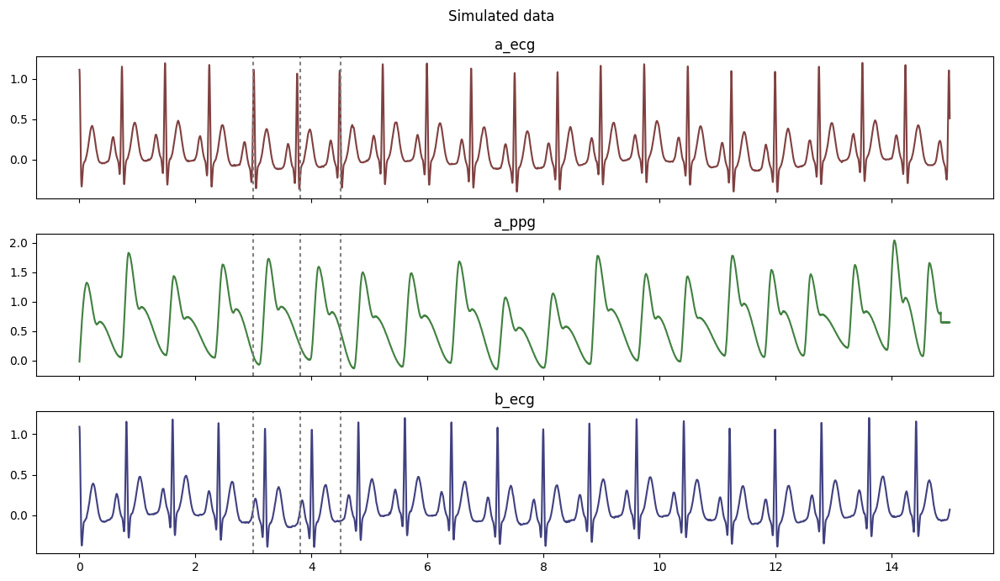
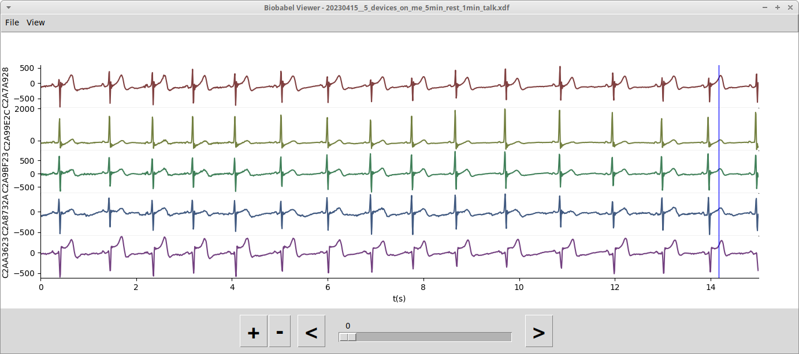

# Summary

Human biosignals such as breathing, cardiac rhythms or skin conductance contain a wealth of information about cognition, emotion and social connection. Measuring these biosignals is now possible using a range of open-source or commercial sensors. However, the software accompanying each of such sensors stores data in all manner of different file formats. This makes it difficult for researchers across the globe to exchange analysis scripts, which is needed for data reproducibility. Biobabel is an open-source software package that reads all the major biosignal file formats and allows programmers to access the data in a unified, straight-forward manner. It provides a handy set of tools for inspecting data and performing basic manipulations. Biobabel thus hopes to contribute to a unified, practical foundation allowing researchers interested in biosignal to focus on extracting meaningful insights from these data.


# Statement of need

There is increasing interest on the part of the neuroscience and psychology research community in biosignals, that is, measurements of cardiac activity (typically from the electrocardiogram, ECG), electrodermal activity (EDA), respiration, and others [@Massaro2016;@Varga2017;@Horvers2021;@PosadaQuintero2020]. There are now wonderful packages for biosignal preprocessing (e.g. neurokit [@neurokit]) and analyzing (e.g. biopeaks [@Brammer2020]). However, progress is hampered by the proliferation of a multitude of file formats (EDF, XDF, OpenSignals, BDF, CSV, Acknowledge ACQ, etc.). Existing software packages typically read only one or two of these formats, requiring researchers to convert between formats which is tedious and error-prone, or simply impossible when using read-only libraries. Furthermore, data in these different formats is typically organized differently, requiring researchers to reorganize their code to cater to different formats. 

Individual Python packages exist that can each read single data formats (e.g. [pyxdf](https://pypi.org/project/pyxdf/) or [pyedflib](https://pyedflib.readthedocs.io/en/latest/)). However, each makes the data available in a different structure. This means that pipelines have to be changed when switching from one data format to another, which is tedious and error-prone. The situation is further complicated by the fact that different file formats make different assumptions about the data structure: in some formats, multiple signals in a file are forced to have the same sampling rate (e.g. OpenSignals) whereas in other formats sampling rates can vary (e.g. XDF). In some cases the signals are supposed to have the same onset time (e.g. EDF) whereas other formats allow different onset times requiring re-aligning (e.g. XDF). All this makes conversion cumbersome and errors can easily slip in. 

This state of affairs also hampers the development of unified, reproducible pipelines that can be shared between research groups across the globe. Increasingly, the field calls for sharing of data analysis pipelines between research groups as an indispensible step to much-needed reproducibility [@Wratten2021]. In addition, sharing analysis pipelines rather than reinventing the wheel allows for more efficient use of scientists' time.

Further, it is becoming increasingly important for physiological software to accommodate data from multiple participants. There is increasing interest in neuroscience in collecting physiological data simultaneously from multiple participants interacting in real-time [@Kelsen2022]. Such *hyperscanning* studies place unique demands on file structures that classically were designed for data from single participants only.

Thus, what is needed is a software package that can read these diverse formats into a reasonably flexible data structure that abstracts away from differences. Such a package reads data from a variety of data formats, accommodating data streams from multiple participants and allowing it to be written in a sensible native open-standard format.

These challenges were already solved for neuroimaging data by the *nibabel* package [@nibabel] from which we draw inspiration here. But for the physiology data, surprisingly such a software suite has been missing until now. 


# Functionality

`biobabel` is a Python package whose main functionalities are:

+ Seamless reading of a host of physiology data file formats.

+ Data flows into an object with a flexible internal structure supporting multiple data streams, time point markers, various sampling rates and multiple participants.

+ Basic data manipulation (cropping in time, selecting subsets of channels, etc.) and visualization (previewing) not typically implemented in existing software packages.

+ A set of Swiss army knife command-line based tools for on-the-fly data inspection and manipulation.

+ Streamlined modular code that allows the package to be easily extended to read file formats not yet included.

+ Data can be written to an open standard file format based on [HDF5](https://www.hdfgroup.org/solutions/hdf5/).

For a full demonstration, see the [basic documentation](https://github.com/florisvanvugt/biobabel/blob/main/README.md) and [illustration notebook](https://github.com/florisvanvugt/biobabel/tree/main/tests).


## Supported data formats

At the time of writing the following data formats are supported:

| Format                              | File extension | Supported by                                                       |
|:-----------------------------------:|:--------------:|:------------------------------------------------------------------:|
| Extensible Data Format              | .xdf           | [pyxdf](https://pypi.org/project/pyxdf/)                           |
| BIOSEMI 24-bit BDF                  | .bdf           | [pybdf](https://pypi.org/project/pybdf/)                           |
| BioPAC Acknowledge                  | .acq           | [bioread](https://pypi.org/project/bioread/)                       |
| OpenSignals (r)evolution / BiTalino | .txt           | [opensignalsreader](https://github.com/PGomes92/opensignalsreader) |
| European Data Format                | .edf           | [pyedflib](https://pyedflib.readthedocs.io/en/latest/)             |
| Generic CSV                         | .csv           | Custom developed code including sniffing and educated guesses      |
| hdphysio5                           | .hdf5          | Native format developed specifically for biobabel                  |

The format of input files is guessed automatically at the time of reading, using clues such as file extension, but if these are insufficiently informative, guesses are made based on sniffing of the file. For some file formats, such as CSV, the way these formats are used varies between research groups: CSV data represents a table but the meaning and names of various columns in this table are not standardized. In those cases, `biobabel` will try to guess the meaning of the various columns, for example automatically guessing one column to be a time column if its values are increasing almost always by the same amount.

Within Python the following code is sufficient to read a data file:
```python
import biobabel as bb
bio = bb.load('tests/example.hdf5')
```

Then, we can view basic properties of the data file:
```python
bio.print()
```

This will produce an overview of the dataset indicating sampling frequencies and durations:
```
Summary of Simulated data
· date  07/20/2023 10:48:32 EDT-0400

Participant 'a'
∟ channel a_ecg [ modality ecg ] 15000 samples @ 1000.0 Hz = 15.0 s
∟ channel a_ppg [ modality ppg ] 15000 samples @ 1000.0 Hz = 15.0 s

Participant 'b'
∟ channel b_ecg [ modality ecg ] 15000 samples @ 1000.0 Hz = 15.0 s
```

And easily inspect the data using a plot:

```python
bio.plot()
```

Which produces:




## Biobabel internal data structure

Interally, `biobabel` stores physiological datasets in a `Biodata` object (`bio` in the above example). Under the hood, this object contains a number of data streams, each of which is a single dimension data array with some associated key-value metadata, such as sampling frequency, participant ID, etc. Each data stream is identified with a unique ID.

The channel metadata allows us to easily find channels by data type:

```python
bio.find_channels({'modality':'ecg'}) # find all channels containing ECG data
```

which returns a set of channel IDs: `['a_ecg', 'b_ecg']`.

The channel IDs can then be used to query the channel metadata (in dictionary format) and extract its data:

```python
hdr,dat = bio.get('a_ecg')
hdr # find the associated metadata for this channel
```

which returns the metadata in `hdr`:

```
{'id': 'a_ecg',
 'participant': 'a',
 'sampling_frequency': 1000,
 'modality': 'ecg'}
```

In `biobabel`, each data stream can have its own sampling frequency, but all data streams are assumed to start at the same time. In my experience analyzing physiological data, this common starting time assumption was sensible, since it holds true in most applications and making this assumption simplifies subsequent data handling. For data formats in which this assumption does not necessarily hold true (e.g. XDF), data loaded into `biobabel` will be cropped by the software package to a common starting time.

`biobabel` also supports *markers*, which are points in time at which specific events are recorded to occur. This can be start/stop markers indicating separate recording segments (e.g. append-markers in BioPAC Acknowledge files). Markers are stored in the Biodata object and can be accessed using `bio.get_markers()` (to find the marker names) and `bio.get_marker(<NAME>)` (to extract the corresponding time points). In default plotting functions of `biobabel` they are indicated with dashed vertical lines (\autoref{fig:simdataplot}).

`biobabel` allows a number of typical data management steps that most packages do not straight-forwardly allow, such as cropping the data to a selected time range (`bio.crop(t_start,t_end)`) and dropping or selecting channels.

Finally, data can be saved in the `biobabel` native HDF5-based format (`bio.save`).

For labs engaging in hyperscanning, `biobabel` seamlessly accomodates support for data from multiple participants. Each data stream can be allocated to a specific participant, allowing the software to find all participants `bio.get_participants()` or get channels for a specific participant (`bio.find_channels({'participant':'b'})`).


## Easy previewing and some manipulation from the command line

`biobabel` provides simple accessible previewing of data files directly from the command line. This functionality is inspired by AFNI [@Cox_1996], a toolbox of shell scripts for neuroimaging analysis.

The following shell scripts are currently included and available automatically if the package is installed via `pip`:

+ `bioinfo <filename>` which reads the data file and prints a summary (a wrapper around `biodata.print()`)
+ `biobabel <filename>` which reads the data file and produces a simple plot (a wrapper around `biodata.view()`)
+ `tohdf5 <filename>` which converts a data file in any of the supported formats into biobabel's native HDF5 format.
+ `biosplit <filename>` which splits the data along its integrated markers (which often correspond to different recording sessions) into multiple separate files (e.g. `<filename_001>`, `<filename_002>` etc.)
+ `bioview <filename>` which launches a graphical user interface (GUI) reader allowing interactive inspection of data as shown below.




## Integration with biosignals processing packages

Since `biobabel` takes care of all the peculiarities of data files, physiological processing pipelines can be substantially simplified. The following boilerplate code reads a data file and automatically finds the ECG columns and preprocesses the data using the excellent Python package `neurokit2` [@Makowski2021]:

```python
import neurokit2
import biobabel as bb
x = bb.load('dataset_copy.hdf5')
prep = {}
for hdr,signal in x.find({'modality':'ecg'}):
    prep[hdr['id']] = neurokit2.ecg_process(
	    signal,sampling_rate=hdr['sampling_frequency'])
```


This code works without modifications for any of the supported data formats.


# Conclusion

At the time of writing, `biobabel` is already being used at the [Human Connection Science Lab](https://connectionscience.org/) and the [International Laboratory for Brain, Music and Sound Research (BRAMS)](https://brams.org). 

It is hoped that `biobabel` will simplify the lives of scientists by abstracting away from the specifics of physiology file formats. Using this package, data processing pipelines can be more easily shared across research groups that rely on different sensors, thus contributing towards greater reproducibility in our field. 


# Acknowledgements

This work was supported by a pilot project grant from the *Centre Interdisciplinaire de Recherche sur le Cerveau et l'Apprentissage* (CIRCA), Montreal, QC, Canada.

Mihaela Felezeu and Alex Nieva at BRAMS provided helpful tutorials on using all manners of biosignals. Inspiration for `biobabel` was taken from [`nibabel`](https://nipy.org/nibabel/) which is a Python library able to read virtually any neuroimaging file format in the known universe, and making it available in a unified Python interface [@nibabel]. `biobabel` also builds on the strengths of a range of packages such as `matplotlib` [@matplotlib], `numpy` [@numpy] and `pandas` [@pandas]. I want to thank the contributors of all those packages for their excellent work.


# References
